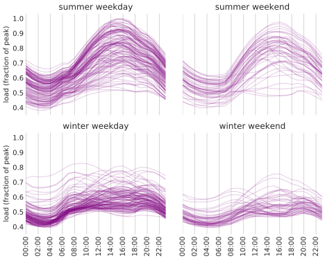
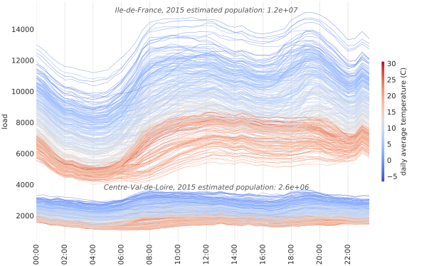
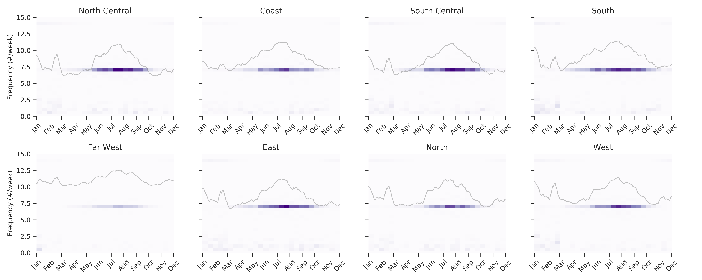
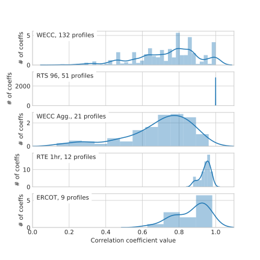
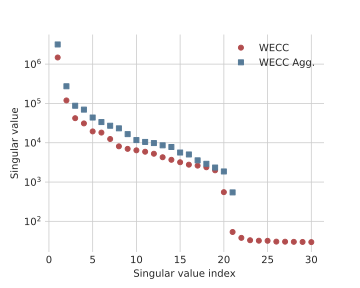

# Introduction
## Goals
- Analyze and develop metrics for load profiles
- Make good use of valuable RTE time series data

## Comparison to system-wide metrics
- Similar strategy
    1. Search broadly for data
    2. Use analysis, prior knowledge to distinguish physical from synthetic
    3. Distill into minimal set of metrics
- Data
    1. Last time we had forty networks
    2. This time we have approximately 40 original load profiles
- Literature
    1. More focused on short-term forecasting
    2. Discovering as we go
    3. Using less domain-specific literature, more from general time series analysis

## Comparison to system-wide metrics
- System-wide metrics: tough to see raw data (illustrate graph structure), but easy to reduce to scalars and distributions
- Time series metrics: easy to see raw data, but harder to reduce to scalars and distributions
- Dynamic behavior

# Data

## Original vs derived

- Original load profile: directly from measurement or synthesis
- Derived time series: dependent on original load profile
- "Time series" refers to either

---

## WECC (CAISO, Western US)
:::::::::::::: {.columns}
::: {.column width="40%"}
- 21 original load profiles, 132 time series
- 8,784 hourly timestamps spanning 2004 (leap year)
- Disaggregation via load participation factors
- We have aggregated version with only the 21 original load profiles
:::
::: {.column width="60%"}
{ width=100% }
:::
::::::::::::::

## RTS 96
:::::::::::::: {.columns}
::: {.column width="40%"}
- 1 original load profile, 51 time series
- The sole original load profile looks strange
- 8,736 hourly timestamps spanning 1996 (except Dec. 30-31, so 364 days)
:::
::: {.column width="60%"}
{ width=100% }
:::
::::::::::::::

## RTE (France)
:::::::::::::: {.columns}
::: {.column width="40%"}
- 12 original load profiles, 12 total time series
- 12 French administrative divisions
- 80,304 half-hourly timestamps spanning 2013 to July 2017 (578 days)
- Realistic, broad, recent
:::
::: {.column width="60%"}
{ width=100% }
:::
::::::::::::::

## ERCOT (Texas)
:::::::::::::: {.columns}
::: {.column width="40%"}
- 8 original load profiles, 8 total time series
- Corresponds to 8 ERCOT weather zones
- 143,135 hourly timestamps spanning 2002 - April 2018 (16 years)
:::
::: {.column width="60%"}
{ width=100% }
:::
::::::::::::::

## RTS GMLC (on GitHub)
:::::::::::::: {.columns}
::: {.column width="40%"}
- 3 synthesized load profiles corresponding to  RTS network areas
- 105,408 5-minute timestamps spanning the year 2020 (366 days)
:::
::: {.column width="60%"}
{ width=100% }
:::
::::::::::::::

## Summary

- ~40 total original load profiles
- ~200 total time series

## Supplementary data for RTE analysis
- zone-level temperature data from TAMU agriculture database
- zone population data from France's INSEE

---

## Basic data observations
- Basic shape depends on region
- Early morning peak often connected to weekdays
- Flatness in absolute units connected to population
- Daily fluctuations connected to population, temperature

## Incidental product
- Each dataset now available in "tidy" form
- Single DataFrame object that can be exported to any tabular data format.
- RTE data was spread across dozens of TSV files in four directories, using two different character encodings

# Individual time series analysis

## Fourier transform
_Obvious to check, but not very useful_

- Load profiles are nonlinear, nonstationary
- Sinusoidal basis functions unaware of inherent load profile characteristics
- More useful for renewable data

---

## Spectrogram

- Illustrate time-varying frequency spectrum
- Motivate models that account for nonstationary behavior

---

_RTE_

---

_ERCOT_

## Singular spectrum analysis

- Based on principal component ideas
- Model-free, non-parametric
- SSA components not necessarily harmonic, advantage over FFT
- "Adaptive spectral filters associated with dominant oscillations" (Bonizzi2014), suitable for nonlinear or nonstationary signals

## Procedure

- Choose window length $L < N/2$, where $N$ is time series length
- Generate "trajectory matrix" of lagged vectors (Hankel matrix) from zero-mean signal (embeds time signal in $L$-dimensional vector space)

# Time domain analysis

---

## Cross-correlation analysis

---

### Cross-correlation matrices

:::::::::::::: {.columns}
::: {.column width="50%"}
_Aggregated WECC_

:::
::: {.column width="50%"}
_Disaggregated WECC_

:::
::::::::::::::

---

### _RTS 96_

---

### Correlation coefficient distributions

### Deriving a correlation metric

---

### Cross-correlation metric results

Fraction of correlation
coefficients above 0.98:

| Dataset  | Fraction |
|----------|----------|
| wecc     | 91.59%   |
| rts96    | 0.00%    |
| wecc_agg | 100.00%  |
| rte      | 98.48%   |
| ercot    | 97.22%   |
| gmlc     | 100.00%  |

## Singular values

---

### Effects of aggregation

---

### Discussion of repeated Eigenvalues

# Generating realistic load profiles

# Conclusions
