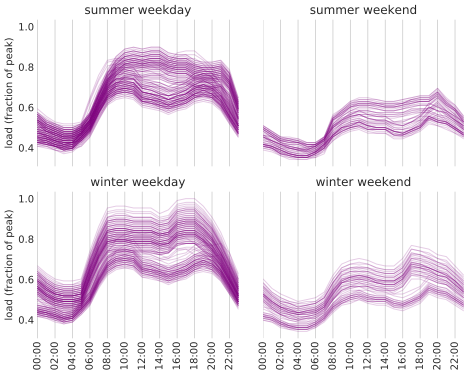
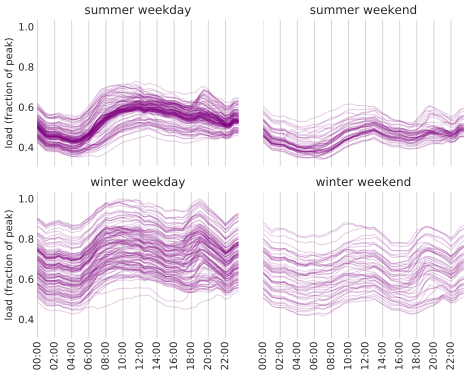
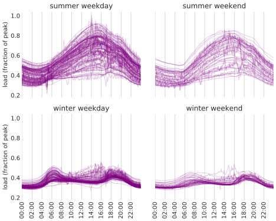
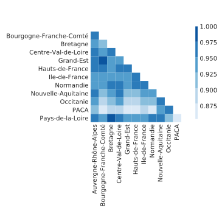
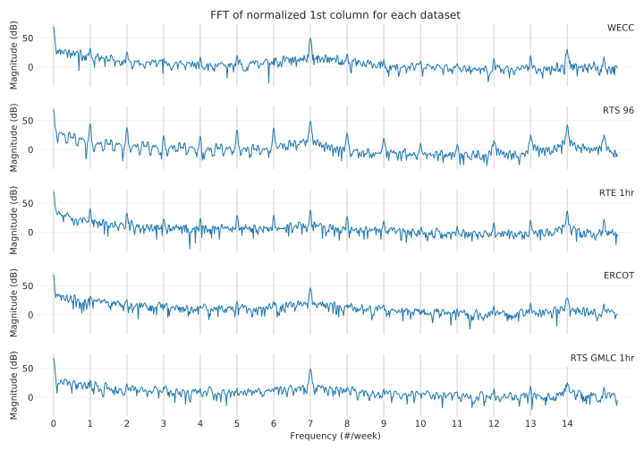
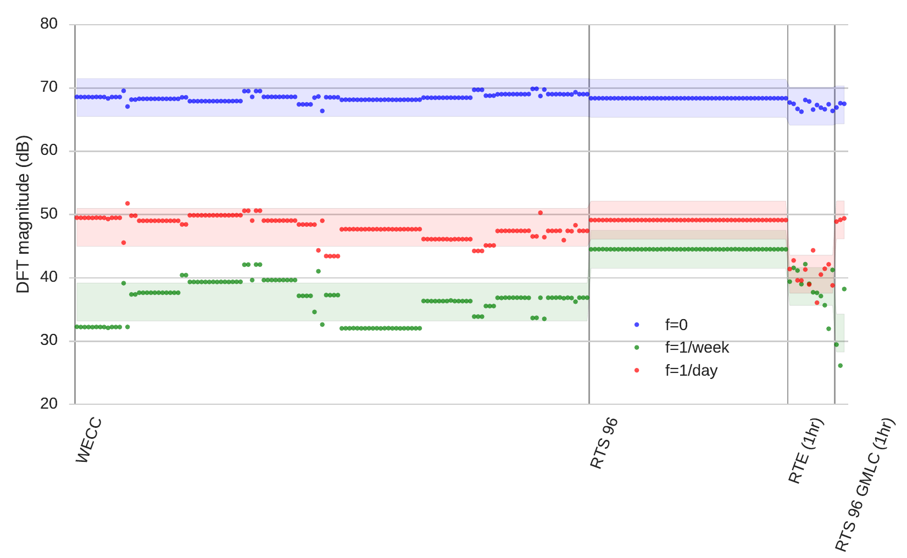
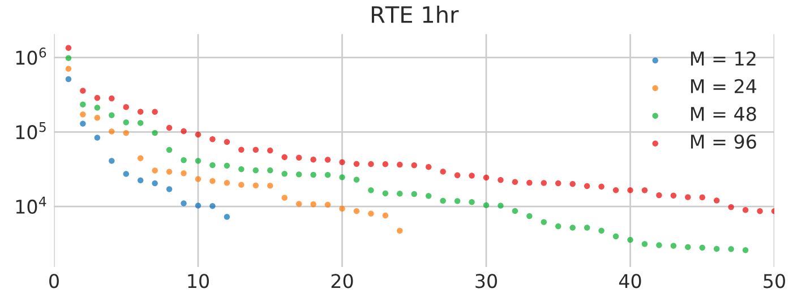
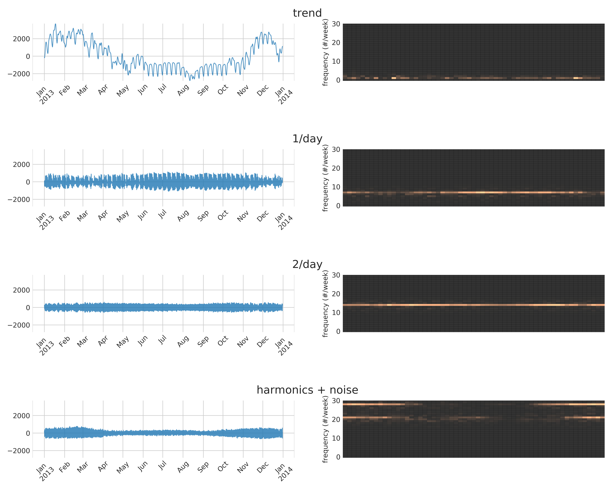
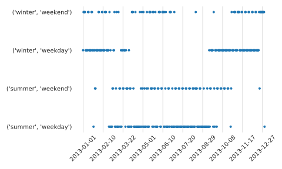

# Introduction
## Goals
- Analyze and develop metrics for load profiles
- Make good use of valuable RTE time series data

## Comparison to system-wide metrics
- Strategy
    1. Obtain large, diverse dataset
    2. Use analysis, prior knowledge to distinguish physical characteristics from synthetic
    3. Distill into minimal set of metrics
- Data
    1. Last time: forty networks
    2. This time: roughly 40 original load profiles
- Literature
    1. Power systems focused on short-term forecasting
    2. Discovering as we go
    3. Less domain-specific literature

## Different challenges
- System-wide metrics: tough to see raw data (illustrate graph structure), but easy to reduce to scalars and distributions
- Time series metrics: easy to see raw data, but harder to reduce to scalars and distributions
- Dynamic behavior

# I. Data

## Original vs derived

- Original load profile: directly from measurement or synthesis
- Derived time series: dependent on original load profile
- "Time series" refers to either

# Five load profile datasets

## WECC (CAISO, Western US)
:::::::::::::: {.columns}
::: {.column width="40%"}
- 21 original load profiles, 132 time series
- 8,784 hourly timestamps spanning 2004 (leap year)
- Disaggregated via load participation factors
- Also have aggregated version with just original load profiles
:::
::: {.column width="60%"}
{ width=100% }
:::
::::::::::::::

## RTS 96
:::::::::::::: {.columns}
::: {.column width="40%"}
- 1 original load profile, 51 time series
- The sole original load profile looks strange
- 8,736 hourly timestamps spanning 1996 (except Dec. 30-31, so 364 days)
:::
::: {.column width="60%"}
{ width=100% }
:::
::::::::::::::

## RTE (France)
:::::::::::::: {.columns}
::: {.column width="40%"}
- 12 original load profiles, 12 total time series
- 12 French administrative divisions
- 80,304 half-hourly timestamps spanning 2013 to July 2017 (578 days)
- Realistic, broad, recent
:::
::: {.column width="60%"}
{ width=100% }
:::
::::::::::::::

## ERCOT (Texas)
:::::::::::::: {.columns}
::: {.column width="40%"}
- 8 original load profiles, 8 total time series
- Corresponds to 8 ERCOT weather zones
- 143,135 hourly timestamps spanning 2002 - April 2018 (16 years)
:::
::: {.column width="60%"}
{ width=100% }
:::
::::::::::::::

## RTS GMLC (on GitHub)
:::::::::::::: {.columns}
::: {.column width="40%"}
- 3 synthesized load profiles corresponding to  RTS network areas
- 105,408 5-minute timestamps spanning the year 2020 (366 days)
:::
::: {.column width="60%"}
{ width=100% }
:::
::::::::::::::

## Summary

- ~40 original load profiles
- ~200 time series
- Each dataset now available in "tidy" form as a portable DataFrame object
    - RTE data was spread across dozens of TSV files in four directories using two different character encodings...

# Additional France data

## Temperature and population
- division-level temperature data from TAMU agricultural database
- division population data from France's INSEE

---

{ width=100% }

## A few observations
- Region: summer-peaking vs winter-peaking
- Early morning peak often associated with weekdays
- RTE: flatness connected to population
- Daily level connected to temperature

# II. Dataset internal consistency

_Metrics that require little time series analysis_

# Cross-correlation analysis
- Real load profiles exhibit cross-correlation
- Very high correlation indicates disaggregation

## Realistic cross-correlation

:::::::::::::: {.columns}
::: {.column width="50%"}
_RTE_

{ width="100%" }
:::
::: {.column width="50%"}
_ERCOT_

:::
::::::::::::::

## Effects of disaggregation

:::::::::::::: {.columns}
::: {.column width="50%"}
_Aggregated WECC_

:::
::: {.column width="50%"}
_Disaggregated WECC_

:::
::::::::::::::

## Bad dataset
:::::::::::::: {.columns}
::: {.column width="30%"}
_RTS 96_

- Copying across areas
- Note color scale
:::
::: {.column width="70%"}
{ width="70%"}
:::
:::::::

## Correlation coefficient distributions
:::::::::::::: {.columns}
::: {.column width="30%"}
- RTS 96 stands out
- High correlation in RTE (winter-peaking region)
:::
::: {.column width="70%"}
{ width="70%" }
:::
:::::::

## Deriving a cross-correlation metric

## Cross-correlation metric

Fraction of correlation coefficients below 0.98:

| Dataset  | Fraction |
|----------|----------|
| wecc     | 91.59%   |
| rts96    | 0.00%    |
| wecc_agg | 100.00%  |
| rte      | 98.48%   |
| ercot    | 97.22%   |
| gmlc     | 100.00%  |

A value below 100% suggests disaggregation.

# Singular values

## Idea
- Treat each load profile dataset as one data matrix (each column is a time series)
- Obtain singular values from the SVD
- Look for small values or "plateaus"

## Singular value distributions
:::::: {.columns}
::: {.column width=30%}
- WECC, RTS 96 stand out again
- "Plateaus"
:::
::: {.column width=70%}
{ width=100% }
:::
:::::

## Effects of disaggregation

## Singular value metric

Fraction of singular values above $10^{-9}$:

| Dataset  | Fraction |
|----------|----------|
| wecc     | 97%   |
| rts96    | 33%    |
| wecc_agg | 100%  |
| rte_1h   | 100%   |
| ercot    | 100%   |
| gmlc     | 100%  |

## Repeated singular values
- Metric idea: detect singular value plateaus
- Some significance to repeated singular values
- Not obvious how to make it robust though

# III. Time series analysis

## Path to SSA and SARIMA
1. Fourier transform
2. Spectrogram
3. Singular spectrum analysis (SSA)
4. Seasonal Auto-Regressive Integrated Moving Average (SARIMA)

# Fourier transform
_Obvious to check, but not very useful_

- Load profiles are nonstationary
- Basis functions unaware of inherent characteristics
- More useful for renewable data

## DFT results
- 1/day and 1/week peaks, harmonics

{ width="70%" }

## DFT summary

- metric idea: use key DFT components to summarize load profiles
- Fails to capture time-varying behavior
- Does reveal disaggregation

{ width="70%" }

# Spectrogram

- Illustrate time-varying frequency spectrum
- Motivate models that account for nonstationary behavior

## Normalized ERCOT load profiles

- Strong 1/day component in summer

## Normalized RTE load profiles
_Gray trace: 7-day moving average_

{ width="90%"}

# Singular spectrum analysis

## Overview

- Based on principal component ideas
- Model-free, non-parametric

In place of sinusoidal basis signals, SSA provides

>"Adaptive spectral filters associated with dominant oscillations" (Bonizzi2014)

suitable for nonlinear or nonstationary signals

## Procedure
Given a centered, length-$N$ time series:

1. Choose window length $M < N/2$.
1. Generate "trajectory matrix" of lagged vectors.
1. Apply SVD to trajectory matrix to obtain eigentriples $U_i, s_i, V_i$.
1. Use eigengaps to group eigentriples.
1. Invert embedding process via diagonal averaging.

Output: SSA components (signal separated into oscillatory components, noise isolated)

## Choosing embedding dimension $M$
- Higher $M$: capture greater periods, cleanly isolate noise
- Lower $M$: eigengrouping easier, analysis faster
- What is the dimension of the signal space?
- Choose multiple of inherent periodicity (Miranian2013)
- $M=24$ makes grouping obvious

{ width=70% }

## WECC SSA components
{ width="70%" }

## RTE SSA components
{ width="70%" }

## RTS 96  SSA components
{ width="70%" }

## SSA metric?
- Nice to efficiently separate trend, 1/day, 2/day, and noise components
- Difficult to reduce to a few numbers
- Tool for understanding data
- Ongoing: understand effects of time resolution, geographic region, etc.

# SARIMA models

## Overview
- Common in time series analysis, some precedent in power systems
- ARIMA is a flexible model for stationary time series
    - AutoRegressive (AR): regress on lagged versions of signal
    - Integrated (I): differencing performed to attain stationarity
    - Moving Average (MA): error term computed from past error terms
- Seasonal ARIMA (SARIMA) simply multiplies a second ARIMA model that captures seasonal variation.

## Procedure
- Tough to choose AR and MA orders for the base and seasonal ARIMA models
- Brute force using Akaike information criterion
- Repeat for each column of RTE to identify one good SARIMA model structure
- Fit all load profiles to this structure, compare parameter values

## SARIMA (1, 1, 0)x(1, 0, 0, 24)

## SARIMA forecast for Normandie

{ width="80%" }

## SARIMA metric?
- Primarily a tool for modeling and forecasting
- Physical meaning of model parameters more obscure than SSA components

# Future work
## Comparing SSA and SARIMA
- Both models can separate signal and noise. Study residuals...
- Both are also used to forecast

## Generating realistic load profiles
- Make indistinguishable synthetic RTE dataset
- Make a better RTS 96 dataset

# Conclusions
## Mix of metrics and results
- Dataset internal consistency metrics can detect disaggregation
    - Cross-correlation
    - Data matrix singular values
- Individual time series analyses isolate signal dynamics from noise
    - Basic DFT
    - Spectrogram
    - Singular spectrum analysis (SSA)
    - Seasonal AutoRegressive Integrated Moving Average (SARIMA) models
- Future work includes publication and load profile generation

# Appendix: day classification
## Approach
1. Assume each day belongs to one of four categories:
    1. summer weekday
    2. summer weekend
    3. winter weekday
    4. winter weekend
2. Use prior knowledge of region to assemble training days for each category.
3. Use SVD to find subspace for each day type.
4. Project test data onto these subspaces. The nearest subspace becomes the test day label.

## Classifying days in Ile-de-France
:::::: {.columns}
::: {.column width=30%}
- Tough to distinguish winter weekends from summer days
- Refine initial assumption about season boundaries in light of predictions
- Add temperature data to enhance method
:::
::: {.column width="70%"}

:::
:::::::
