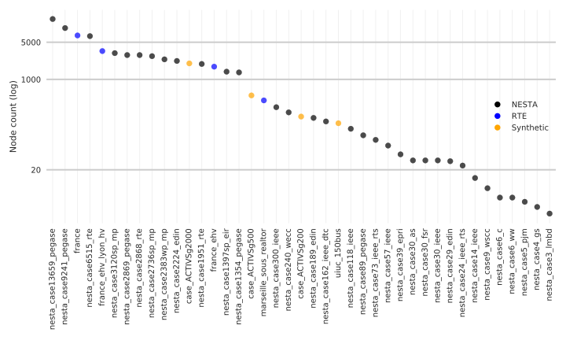
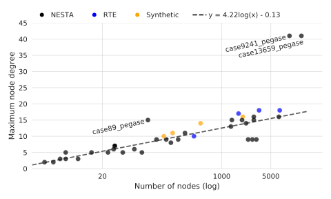
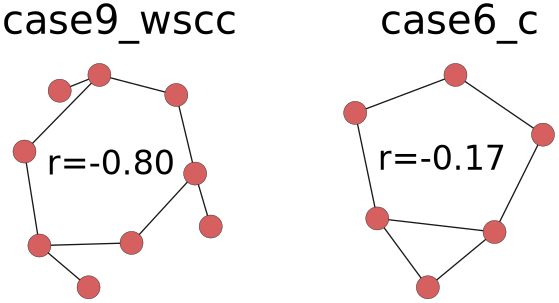
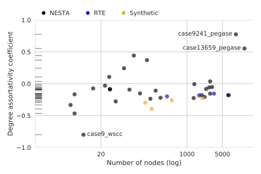
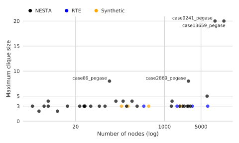
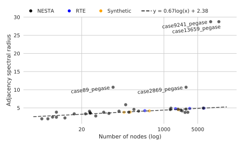
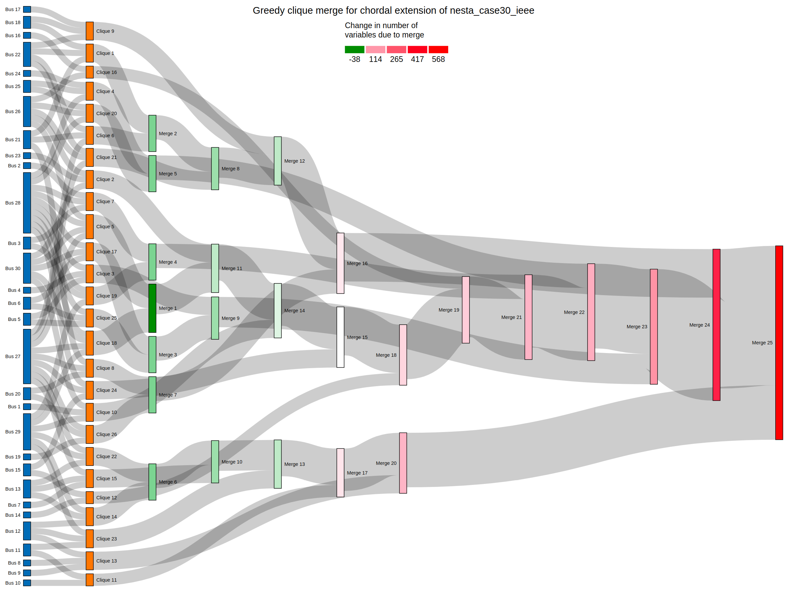
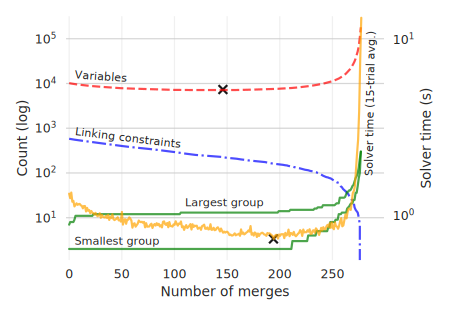

<h1>Topological Graph Metrics for Detecting Grid Anomalies and Improving Algorithms</h1>

_Power system reliability and security session, PSCC session 27_

_June 14, 2018_

:::::::::::::: {.columns .authortable}
::: {.column width="38%"}
### Jonas A. Kersulis, Ian A. Hiskens

#### Electrical Engineering and Computer Science

#### University of Michigan

Ann Arbor, MI, USA
:::
::: {.column width="28%"}
### Carleton Coffrin

#### Advanced Network Science Initiative

#### Los Alamos National Laboratory

Los Alamos, NM, USA

:::
::: {.column width="28%"}
### Daniel K. Molzahn

#### Energy Systems Division

#### Argonne National Laboratory

Argonne, IL, USA
:::
:::::::::::

Work supported by US ARPA-E GRID DATA program

# Why graph structure?

- Key reliability consideration
- Quickly detect unusual connectivity patterns
- Algorithm performance implications

# Detecting structural anomalies

### Ingredients

- Many potential graph-theoretical metrics
- Context provided by broad network set
- Literature on known unusual topologies

### Results

- Systematic identification of anomalous structure
- Effective set of topological graph metrics; intuitive warnings
- SDP OPF solver performance implications

# Networks

{width="80%"}

- 33 community test cases from NESTA [@coffrin2014]
- 5 PEGASE variants [@josz2016]
- 4 RTE networks from recent partnership
- 4 synthetic test cases from Overbye group [@birchfield2016]

# Metrics

- Degree distribution
    - **Max**, median, mean
- **Degree assortativity**
- **Rich-club coefficient**
- Clique composition
    - **Maximum clique size**
- **Adjacency matrix spectral radius**
- Fiedler value
- Sensitivity matrix analysis
    - Admittance matrix
    - Injection shift factors
- Thevenin impedance distances

_Reduce to set of fast, intuitive checks_

---

## Maximum node degree

{ width="80%" }

- High max degree of large PEGASE cases has been pointed out [@cuffe2016]
- case89 max degree is unusual for its size

---

## Degree assortativity

:::::{.columns}
:::{.column width="40%"}
- Extent to which nodes of like degree connect to each other
- Coefficient $r\in (-1, 1)$
:::
:::{.column width=30%}
{width="80%"}
:::
::::::

Just 3 networks with $|r|>0.5$ (2 PEGASE + trivial example)

---

## Rich-club effect

::: {.column width="75%"}
- If a graph has 90% of all possible edges between nodes of degree 10 or greater, the rich club coefficient for $k=10$ is 0.9.
- Detects "hub of hubs" suggested by high $r$.
:::

All rich clubs with more than 80% of potential edges and at least 3 nodes:

|                  | Nodes involved  | Degree |
|------------------|-----------------|--------|
| case9241 pegase  |              28 |    >25 |
| case13659 pegase |              19 |    >29 |
| case89 pegase    |              11 |    >11 |
| case2869 pegase  |               5 |    >13 |
| case3 lmbd       |               3 |     >0 |

Four PEGASE cases and one trivial case

---

## Maximum clique size

All four outliers are PEGASE cases.

---

## Adjacency matrix spectral radius

Again, reasonable spread with PEGASE outliers

---

## Summary

- Corroboration, contextualization of grid quirks; reference dataset
- Computationally efficient, intuitive graph metrics
- Tool that analyzes networks and generates messages

# Improving SDP OPF performance

- OPF relaxation: replace power flow constraints with semidefinite constraint
- Promising despite computational intensity [@lesieutre2011]
- Use matrix completion theorem [@jabr2012] to replace big constraint with one small constraint per maximal clique
- Greedily merge some cliques together to eliminate overlap [@molzahn2013]

Tradeoff: many linking constraints vs large constraint matrices

_What is the optimal decomposition?_

---

## Clique merge

1. Form a chordal graph extension
2. Identify maximal cliques (linear-time algorithm)
3. Merge cliques according to overlap (eliminate linking constraints)
4. Stop merging cliques before submatrix size grows too large

---

## What clique merge looks like

{width="80%"}

---

## Potential for improvement

- Effective problem size is minimized _before_ solution time
- Solution time is minimized roughly when the last clique is merged into another group

---

# Main takeaways

1. Topological graph metrics are powerful in the right settings
    - Context highlights network reduction in PEGASE networks
2. Clique composition tied to SDP OPF solver performance

# References
